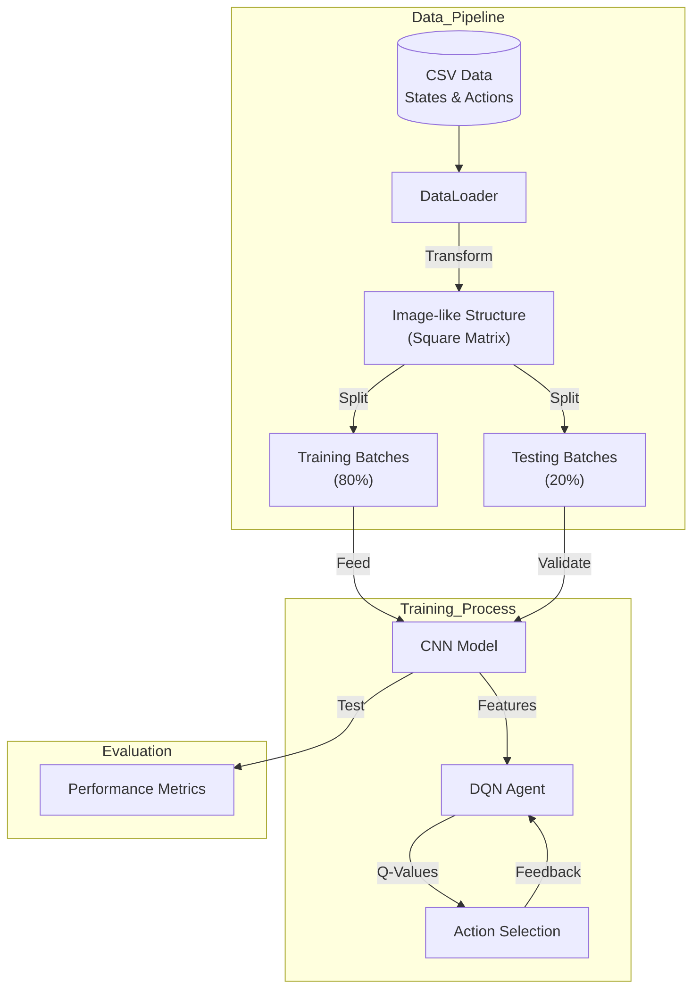
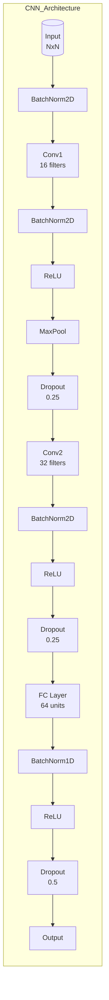
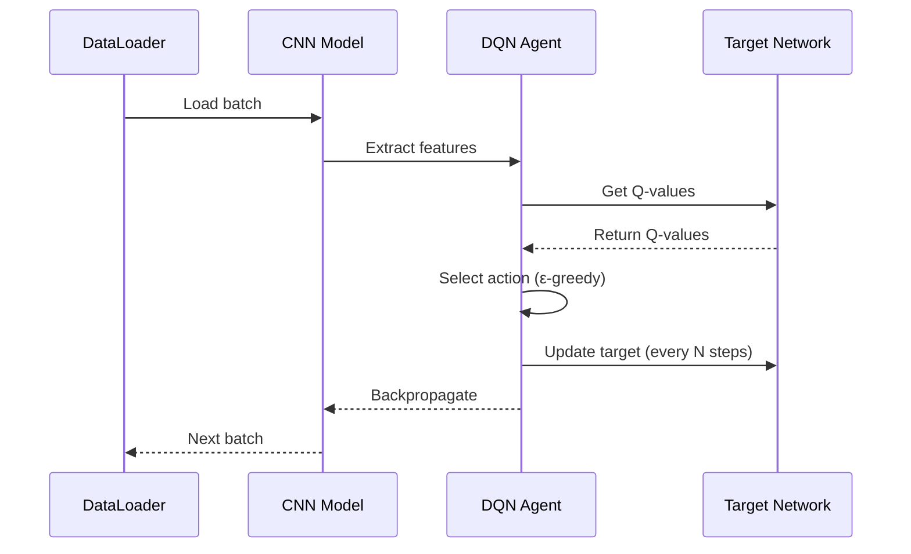

# Project Documentation: Deep Q-Learning with CNN Integration

## Overview
This project implements a hybrid Deep Q-Learning (DQL) system that combines Convolutional Neural Networks (CNN) with traditional DQN for reinforcement learning tasks. The system is designed to handle both image-like data processing and sequential decision making.

## System Architecture

The system follows a modular architecture with three main components:
1. Data Pipeline
2. Training Process
3. Evaluation System

### High-Level Data Flow


## Data Handling

### Data Loading and Preprocessing (`DataLoader` class)
- **Input Format**: Data is loaded from CSV files containing state features and action labels
- **Data Transformation**:
  - Features are reshaped into image-like structures for CNN processing
  - Automatic padding is applied if feature dimensions don't match perfect square dimensions
  - Data is split into training and testing batches (default 80/20 split)
- **Batch Processing**:
  - Implements mini-batch training with configurable batch sizes
  - Creates sequential pairs of states (st, st+1) for Q-learning
  - Shuffles data randomly for better training

### Data Batching Process
1. States are paired with their next states (st → st+1)
2. Actions are associated with their corresponding states
3. Data is shuffled and divided into batches
4. Separate batches are maintained for training and testing

#### Technical Details:
- **State Representation**: Each state is transformed into a square matrix (N×N) to enable CNN processing
- **Padding Strategy**: Zero-padding is applied to maintain square dimensions
- **Memory Management**: Batches are generated on-the-fly to optimize memory usage
- **Data Augmentation**: Optional augmentation techniques can be applied during batch generation

## Model Architectures

### 1. CNN Model (`CNNModel` class)
The CNN model is designed for feature extraction and processing image-like data:

#### Detailed Architecture:


#### Layer-by-Layer Breakdown:
1. **Input Layer**:
   - Accepts N×N image-like state representations
   - Applies initial batch normalization

2. **Convolutional Block 1**:
   - 16 filters with 3×3 kernel
   - Batch normalization
   - ReLU activation
   - 2×2 max pooling
   - 25% dropout

3. **Convolutional Block 2**:
   - 32 filters with 3×3 kernel
   - Batch normalization
   - ReLU activation
   - 25% dropout

4. **Fully Connected Layers**:
   - 64 units with batch normalization
   - ReLU activation
   - 50% dropout
   - Output layer

### 2. Target Network (`SimpleTargetNet` class)
A simpler network used for Q-value prediction:

#### Architecture Details:
- **Input Layer**: Accepts flattened feature vectors
- **Hidden Layer 1**: 64 units with ReLU
- **Hidden Layer 2**: 32 units with ReLU
- **Output Layer**: Action-space dimension with Softmax

### 3. Training Process Integration

The training process involves complex interaction between components:



## Advanced Features

### 1. Adaptive Learning
- Dynamic learning rate adjustment using ReduceLROnPlateau
- Early stopping with configurable patience
- Gradient clipping to prevent exploding gradients

### 2. Experience Replay
- Circular buffer implementation
- Prioritized sampling based on TD-error
- Configurable replay buffer size

### 3. Exploration Strategies
- ε-greedy with linear decay
- Optional Boltzmann exploration
- Noisy network exploration

## Hyperparameter Configuration

### Critical Parameters:
```python
LEARNING_RATE = 0.001    # Initial learning rate
EPSILON = 0.8            # Starting exploration rate
EPSILON_DECAY = 0.995    # Exploration decay rate
LAMBDA = 0.01           # Weight decay for regularization
BATCH_SIZE = 64         # Mini-batch size
TARGET_UPDATE = 10      # Target network update frequency
REPLAY_BUFFER_SIZE = 10000  # Experience replay buffer size
```

### Parameter Tuning Guidelines:
1. **Learning Rate**:
   - Start with 0.001
   - Monitor validation loss
   - Adjust scheduler patience based on convergence

2. **Exploration**:
   - Higher ε for new environments
   - Slower decay for complex action spaces
   - Monitor action distribution

3. **Network Updates**:
   - More frequent updates for unstable environments
   - Balance between stability and adaptability

## Performance Monitoring

### 1. Training Metrics
- Loss curves with moving averages
- Action distribution analysis
- Q-value statistics

### 2. Validation Metrics
- Episode returns
- Policy entropy
- Value function error

### 3. Testing Metrics
- Success rate
- Average reward
- Policy consistency

## Best Practices and Tips

### 1. Data Preparation
- Normalize input features
- Handle missing values appropriately
- Validate data distributions

### 2. Model Training
- Start with simpler architectures
- Gradually increase complexity
- Monitor gradient norms

### 3. Debugging
- Use gradient clipping
- Implement proper logging
- Monitor network statistics

### 4. Production Deployment
- Save model checkpoints
- Version control hyperparameters
- Document environment setup 